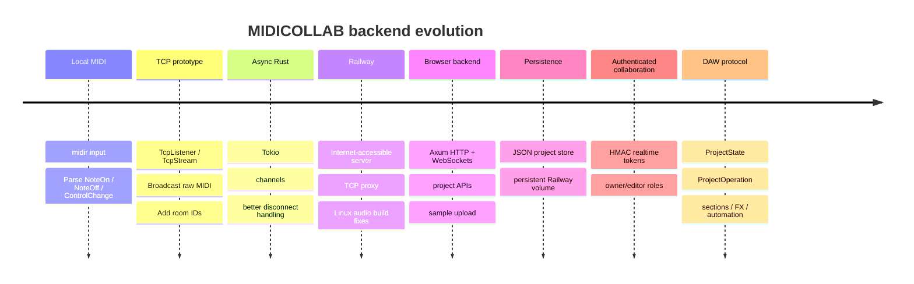
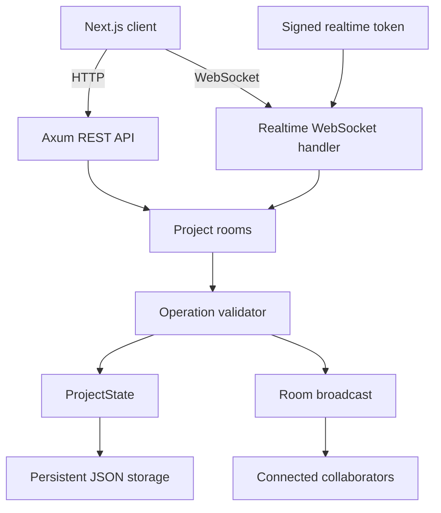
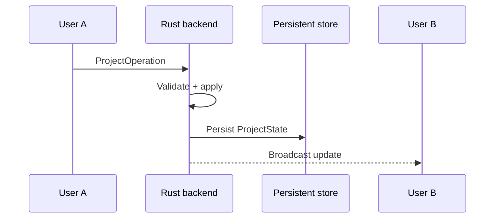
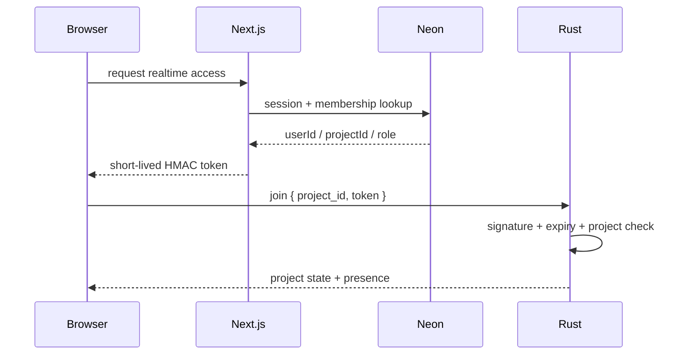
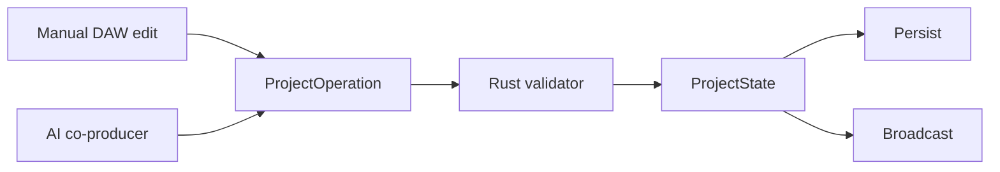

# MIDICOLLAB Realtime Backend

> Rust realtime collaboration, validation, and persistence backend for MIDICOLLAB.

This repository contains the Rust backend that powers project rooms, WebSocket collaboration, authoritative project state, validation, and persistence for the MIDICOLLAB browser studio.

# Why Rust?

The project began as a realtime MIDI networking experiment, making Rust a natural fit for:
- async networking
- concurrency
- predictable performance
- MIDI/device integration
- safe shared state
- a backend that could grow from raw messages into structured project synchronization

# Development timeline



# Architecture



# Core responsibilities

## Realtime project rooms
Each project room maintains:
- current `ProjectState`
- connected clients
- broadcast channel
- presence information

## Operation validation
Incoming `ProjectOperation`s are parsed, validated, clamped, applied, persisted, and broadcast.

## Persistence split

### Neon / Next.js owns
- users
- sessions
- project metadata
- ownership
- membership
- public/deleted state

### Rust owns
- tracks
- clips
- notes
- sections
- instruments
- mixer state
- automation
- realtime musical document

# Realtime flow



The frontend can apply operations optimistically for responsiveness while the Rust backend remains responsible for authoritative validation/persistence.

# Authentication flow

The production flow no longer trusts a manual username/room ID.



# ProjectOperation

One of the most important architectural changes was moving from raw MIDI forwarding to structured DAW operations.

Examples include:

```text
rename_project
set_bpm
set_bars
set_playing
set_loop
add_track
move_clip
resize_clip
set_clip_notes
set_clip_drum_steps
set_key
set_scale
set_swing
add_section
update_section
set_track_fx
set_track_kit
add_automation
clear_automation
```

The same operation language is used by:
- manual browser edits
- remote collaborator edits
- AI co-producer edits



# Early problems and fixes

## No physical MIDI keyboard
Development happened on macOS without hardware MIDI.

**Approach:** macOS IAC Driver virtual ports.

Observed messages included:

```text
[144, 60, 100] -> NoteOn C4 velocity 100
[128, 60, 0]   -> NoteOff C4
```

The parser expanded to model `NoteOn`, `NoteOff`, and `ControlChange`.

## MIDI feedback
Using the same virtual MIDI path for input and output caused feedback.

**Fix:**
- Bus 1 -> input
- Bus 2 -> output

## Broken pipe errors
The early TCP server hit:

```text
Broken pipe (os error 32)
```

when clients disconnected.

**Fix:** evolve toward Tokio async handling/channels, then the WebSocket room architecture.

## Railway Linux build failure
The native MIDI dependency path required ALSA headers on Linux.

**Fix:** install `libasound2-dev` in the Railway build environment.

## Railway start/binary issues
Deployment also hit:
- `No start command detected`
- `./bin/studio_server: No such file or directory`
- `cargo: command not found`

**Fix:** correct the Railway build/run configuration and use the browser-oriented `studio_server` service.

## Protocol evolution
Raw MIDI packets were not enough once the product had browser clips, persistence, auth, and AI edits.

**Fix:** introduce `ProjectState` + `ProjectOperation`.

## Persistence
Realtime rooms needed to survive restarts.

**Fix:** persist project documents under `DATA_DIR`, with Railway intended to mount a persistent volume at:

```text
/data
```

and:

```env
DATA_DIR=/data
```

## WebSocket authentication
Manual usernames/project IDs were not secure enough.

**Fix:** Next.js verifies Better Auth session + project membership and mints a short-lived signed realtime token. Rust verifies its signature, project ID, expiry, and role.

# Local development

Typical command:

```bash
DATA_DIR=./data REALTIME_SHARED_SECRET=<shared-secret> PORT=8090 cargo run --release --bin studio_server
```

Then the Next.js app points at:

```env
NEXT_PUBLIC_API_URL=http://localhost:8090
NEXT_PUBLIC_WS_URL=ws://localhost:8090/ws
```

# Railway deployment

Typical production configuration:

```env
REALTIME_SHARED_SECRET=...
DATA_DIR=/data
```

The same realtime secret must be configured in the Next.js deployment.

When frontend and backend introduce protocol changes together, deploy compatible versions together; backend-first followed immediately by frontend is the safer order.

# Current backend capabilities

- project rooms
- realtime WebSocket collaboration
- variable song length
- tracks / clips / notes
- drum grids
- sections
- key / scale
- swing
- synth presets
- drum kits
- track FX
- automation
- seeking / loops
- persistent project state

# Current technical priorities

## P0
- Revision history / snapshots
- Undo-friendly operation history
- stronger conflict handling

## P1
- Batch/transaction semantics for large AI edits
- operation IDs / idempotency
- reduce overhead for 40-90-operation arrangements

## P2
- Durable sample/object storage
- state backups
- project document schema versioning/migrations

## P3
- Observability
- tracing
- room metrics
- WebSocket latency metrics
- reconnect/persistence diagnostics

## P4
- Scale-out path
- shared pub/sub if multiple backend instances are introduced
- load testing across many rooms/users

# Why this backend matters

The AI uses the same project model as humans:

```text
Human edit --------\
                    -> ProjectOperation -> Rust -> persisted collaborative song
AI edit -----------/
Remote user edit --/
```

That makes generated changes editable, persistent, collaborative, attributable, and eventually undoable/versionable.

# Status

Active development. The backend has evolved from a raw Rust MIDI networking experiment into the realtime state engine for a collaborative browser DAW and AI co-producer.
